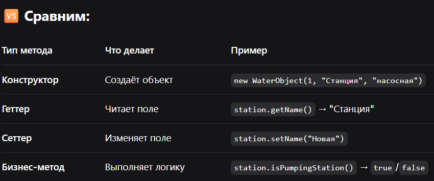

# 🚀 Шпаргалка по Git для проекта Water Management System

## 🔥 ОСНОВНЫЕ КОМАНДЫ (запомнить!)

```bash
# 1. Подготовить всё к сохранению
git add .

# 2. Сохранить с названием (делай после каждой задачи!)
git commit -m "Описание того, что сделал"

# 3. Отправить в облако (GitHub)
git push

# Посмотреть статус файлов
git status

# Посмотреть историю коммитов
git log --oneline

# Посмотреть что изменилось в файлах
git diff

# Отменить последний коммит (осторожно!)
git reset --soft HEAD~1

# Посмотреть какие файлы будут удалены/добавлены
git status
```
## 💡 ПРАВИЛО для начинающего, всегда делай так: 
```bash

Поля — private

Доступ — через public геттеры/сеттеры

Конструктор — для обязательных полей

Это профессиональный стандарт, а не прихоть!
```


💡 Как отличить:
Возвращает boolean? → Скорее всего бизнес-метод

Название начинается с is..., can..., has...? → Бизнес-метод

Просто возвращает поле? → Геттер

Просто устанавливает поле? → Сеттер